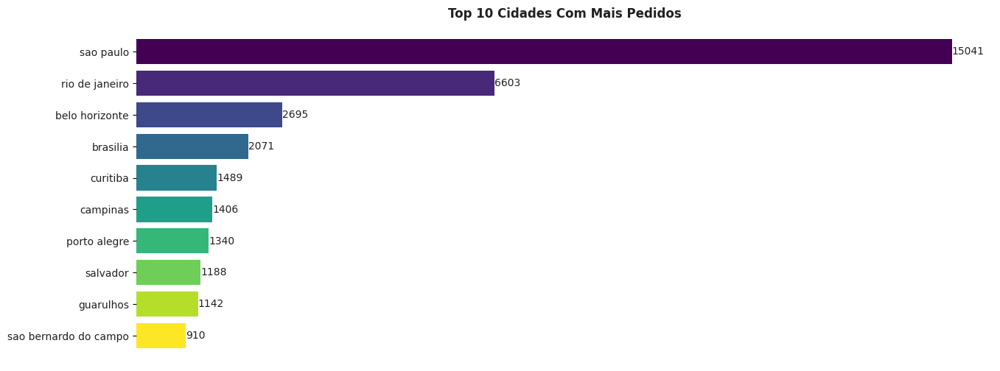

# Análise Exploratória de Dados da Olist

# 1. Descrição
- Neste projeto, realizarei uma análise exploratória de dados de um e-commerce brasileiro, a Olist. Algumas perguntas de negócio serão formuladas e respondidas através de técnicas de coleta, limpeza, exploração e visualização de dados.
- Este é um conjunto de dados público de comércio eletrônico brasileiro de pedidos feitos na Olist Store. O conjunto de dados contém informações de 100 mil pedidos de 2016 a 2018 feitos em vários marketplaces no Brasil. Suas características permitem visualizar um pedido a partir de várias dimensões: desde o status do pedido, preço, desempenho de pagamento e frete até a localização do cliente, atributos do produto e, finalmente, análises escritas pelos clientes. Também foi lançado um conjunto de dados de geolocalização que relaciona os códigos postais brasileiros a coordenadas de latitude/longitude.
- Este conjunto de dados foi generosamente fornecido pela Olist, a maior loja de departamentos nos marketplaces brasileiros. A Olist conecta pequenas empresas de todo o Brasil a canais sem complicações e com um único contrato. Esses comerciantes podem vender seus produtos através da Olist Store e enviá-los diretamente para os clientes usando os parceiros logísticos da Olist. Saiba mais em seu site: www.olist.com
- Após um cliente comprar o produto da Olist Store, um vendedor é notificado para atender ao pedido. Assim que o cliente recebe o produto, ou a data de entrega estimada expira, o cliente recebe uma pesquisa de satisfação por e-mail, onde pode atribuir uma nota para a experiência de compra e escrever alguns comentários.
- Abaixo, tem-se o schema do banco de dados, utilizado para unir datasets e obter os dados necessários para responder as perguntas de negócio.

# 2. Tecnologias utilizadas
Python (Pandas, Numpy, Matplotlib, Seaborn), Jupyter Notebook, Git e Github (versionamento de código), Anaconda (terminal e ambiente virtual) e VSCode (ambiente de desenvolvimento).

# 3. Perguntas de negócio 
As seguintes perguntas de negócio foram formuladas por mim e respondidas, com o objetivo de descrever aspectos sobre os pedidos, clientes, vendedores, itens comprados, entre outros fatores, a fim de possibilitar futuras tomadas de decisão informadas para a empresa.

1. Qual o preço médio dos produtos comprados?
2. Qual o valor médio pago por pedido?
3. Em quantas parcelas, em média, os pedidos são parcelados?
4. Quais estados vendem mais? (número de pedidos e valor médio pago por pedido)
5. Quais cidades vendem mais?
6. Quais as categorias de item mais vendidas?
7. Quais as categorias de item mais vendidas por região?
9. Qual o número médio de itens por pedido?
10. Onde estão localizados os clientes?
11. Onde estão localizados os vendedores?
12. Qual o número médio de parcelas no pagamento, por região?
13. Como se dá a evolução mensal das vendas ao longo do tempo?
14. Como se dá a evolução das vendas ao longo do dia? Em quais horários são feitos mais pedidos?
15. Como se dá a evolução das vendas ao longo da semana? Em quais dias da semana são feitos mais pedidos?
16. Qual o valor médio do frete pago por pedido?
17. Em quais regiões se paga um maior frete e um menor frete, em média? E quanto aos estados?
18. Qual o review score médio dos pedidos?
19. Quais regiões do país apresentam um maior review score nos seus pedidos, e um menor? E quanto aos estados?
20. Qual o número médio de dias para se entregar um pedido?
21. Quais regiões do país apresentam o maior tempo médio de entrega, e o menor? E quanto aos estados?
22. Existe alguma correlação entre o valor pago em um pedido e o número de parcelas escolhido para o pagamento?

Para acessar a resposta de todas as perguntas de negócio elaboradas, basta checar o notebook: https://github.com/allmeidaapedro/Olist-Analysis/blob/main/eda.ipynb

# 4. Planejamento da solução
O seguinte passo a passo foi seguido, baseado no framework CRISP-DM

1. Coleta de dados.
2. Entendimento do contexto negócio.
3. Entendimento dos dados.
4. Limpeza dos dados.
5. Análise exploratória de dados.
6. Conclusão.

A abordagem completa dessas etapas, explicando o objetivo de cada decisão tomada, encontra-se no notebook: https://github.com/allmeidaapedro/Olist-Analysis/blob/main/eda.ipynb

# 5. Principais insights de negócio

1. Em 90% dos pedidos, apenas um item é comprado. A Olist deve trabalhar para aumentar esse número.

2. O valor médio pago por pedido é de aproximadamente 160 reais. Ademais, com base no IQR, 50% dos pedidos custaram entre 62 e 176 reais. É possível perceber que os valores pagos seguem uma distribuição assimétrica à direita, contendo vários outliers. Entretanto, estes foram investigados e não representam informação inconsistente, portanto, permaneceram na análise.

3. Estados das regiões sul e sudeste concentram os maiores números de pedidos, clientes e vendedores. Em especial, o estado de São Paulo e a sua capital apresentam valores maiores que todos os outros. Enquanto isso, estados das regiões norte e nordeste apresentam os menores indicadores.

4. Entre os itens mais vendidos, estão produtos para a casa e móveis, produtos de cama, mesa e banho, e produtos para beleza e saúde.

5. Clientes das regiões norte e nordeste tendem a dividir o pagamento em um maior número de parcelas por pedido (em média), enquanto clientes das regiões sul e sudeste apresentam um menor número. Isso faz sentido, uma vez que tais regiões possuem os piores indicadores de renda do país.

6. De forma geral, as vendas cresceram ao longo dos dois anos, atingindo seu ápice em novembro de 2017, provavelmente por conta da black friday. Ademais, é possível perceber que após esse pico em 2017, as vendas tendem a se manter em um número elevado em relação a anos anteriores.

7. Durante um dia, a maioria dos pedidos é feita entre 10h e 16h. Especialmente, as vendas diárias atingem um pico em volta das 11h e das 16h.

8. As vendas tendem a decrescer com o passar da semana. Segunda-feira é o dia com o maior número de pedidos, enquanto sábado é o dia com o menor número.

9. Estados das regiões norte e nordeste pagam, em média, o maior frete por pedido. Especialmente, o frete pago na região norte é duas vezes maior que o frete pago na região sudeste (menor de todos). Da mesma forma, pedidos feitos nesses estados demoram, em média, mais de duas vezes o número de dias para serem entregues em relação a estados do sul e sudeste. Isso ocorre pois, a grande maioria dos vendedores concentra-se no estado de São Paulo e nos grandes centros.

10. 75% dos pedidos possuem um review score de 4 ou 5. Ademais, isso se replica entre as regiões e estados do país, que apresentam um score médio em torno de 4. Isso indica uma boa satisfação dos clientes, no geral.

# 6. Próximos passos e aprendizado
- A fim de tornar a análise ainda mais completa, pretendo incluir gráficos representando o mapa do Brasil e adicionar o dataset de marketing, que também é fornecido pela Olist e pode ser unido àqueles utilizados nesse projeto.
- Nessa análise, aprendi muito sobre visualização, manipulação e limpeza de dados, uma vez que tentei aplicar boas práticas de storytelling, como eliminação de saturações e utilização de cores acessíveis, foi necessário unir várias tabelas realizando agregações e manipulações para obter informações coerentes, e havia vários outliers e categorias que podiam ser unidas/excluídas das variáveis numéricas e categóricas.
- Finalmente, por se tratar de dados reais e um contexto real de uma empresa, o aprendizado foi enorme.

# 7. Execute o projeto na sua máquina
Para <b>executar os notebooks localmente</b>, certifique-se de ter instalado:

- Python 3.11.4
- pip (Gerenciador de pacotes Python)
- Git (Ferramenta de controle de versão)
- Jupyter (Executar os notebooks)

Depois de ter isso instalado, abra um terminal em sua máquina local e execute os seguintes comandos:

1. Clone o repositório:
<pre>
git clone https://github.com/allmeidaapedro/Olist-Analysis.git
</pre>

2. Navegue até o diretório do repositório clonado:
<pre>
cd Olist-Analyss
</pre>

3. Crie um ambiente virtual:
<pre>
python -m venv venv
</pre>

4. Ative o Ambiente Virtual:
- Ative o ambiente virtual usado para isolar as dependências do projeto.
<pre>
source venv/bin/activate  # No Windows, use 'venv\Scripts\activate'
</pre>

5. Instale as Dependências:
- Use o pip para instalar as dependências necessárias listadas no arquivo requirements.txt.
<pre>
pip install -r requirements.txt
</pre>

6. Inicie o Jupyter Notebook:
- Para iniciar o Jupyter Notebook, execute o seguinte comando:
<pre>
jupyter notebook
</pre>
- Isso abrirá uma nova aba ou janela em seu navegador da web com a interface do Jupyter Notebook.
- Abra e execute o Notebook em que foi feita a análise:
- Você deverá ver o Notebook 'eda.ipynb'. Clique no notebook para abri-lo. Uma vez aberto, você pode executar células individuais ou o notebook inteiro clicando no botão "Run".

7. Desative o Ambiente Virtual (Opcional):
- Quando terminar de trabalhar com o notebook e quiser sair do ambiente virtual, você pode desativá-lo usando o seguinte comando:
<pre>
deactivate
</pre>

# 8. Dados utilizados
Os dados foram obtidos do kaggle, no link: https://www.kaggle.com/datasets/olistbr/brazilian-ecommerce?select=olist_customers_dataset.csv

# 9. Contato
<b>Linkedin:</b> https://www.linkedin.com/in/pedro-henrique-almeida-oliveira-77b44b237/

<b>Github:</b> https://github.com/allmeidaapedro

<b>Gmail:</b> pedrooalmeida.net@gmail.com
